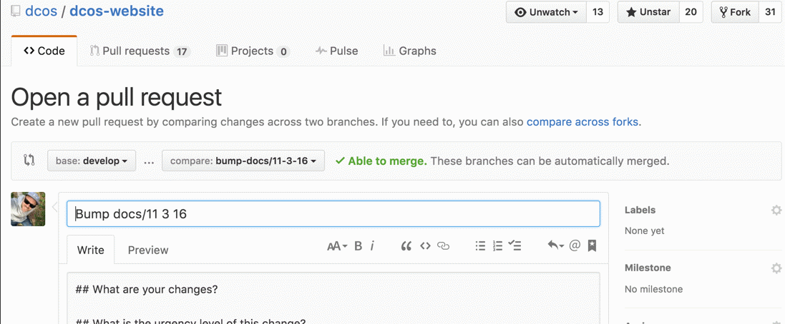
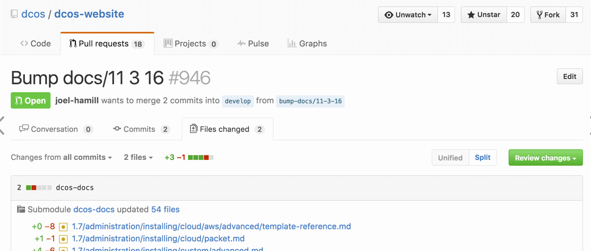

# DC/OS website

| Environment | URL | Build Status |
|-------------|-----|--------------|
| Production | <https://dcos.io> | [](https://jenkins.mesosphere.com/service/jenkins/job/public-dcos-website-deploy-prod/) |
| Development | <https://dev.dcos.io> | [](https://jenkins.mesosphere.com/service/jenkins/job/public-dcos-website-deploy-dev/) |

**Issue tracking is moving to the [DCOS JIRA](https://dcosjira.atlassian.net/) (Project: [SITE](https://dcosjira.atlassian.net/projects/SITE/issues)).
Issues on GitHub will be disabled soon.**

Table of contents:

- [Contribution Workflow](#contribution-workflow)
- [Testing your updates locally](#testing-your-updates-locally)
- [Updating the documentation](#updating-the-documentation)
- [Managing redirects](#managing-redirects)
- [Promoting site to live](#promoting-site-to-live)
- [Link checking](#link-checking)
- [Technology](#technology)

## Contribution Workflow

1. [Create a repo fork in GitHub](https://guides.github.com/activities/forking/)
1. [Clone the dcos/dcos-website repo](https://help.github.com/articles/cloning-a-repository/)
1. Add repo fork as remote repo:

    ```
    git remote add fork https://github.com/<github-user>/dcos-website
    git fetch fork
    ```
1. Checkout the develop branch:

    ```
    git checkout develop
    ```

1. Create a new feature branch:

    ```
    git checkout -b feature/<feature-name>
    ```

1. Make local changes.

1. Test your changes [locally](#).

1. Add and commit changes:

    ```
    git add -p .
    git commit
    ```

1. Rebase repo fork to include recent `dcos/dcos-website:develop` changes. Rebasing a repo (instead of merging) will keep your fork commit history clean and move all your changes to the top of the commit log.

    ```
    git fetch origin
    git pull --rebase origin develop
    ```
    **Tip:** May require resolving conflicts.

1. Push changes to repo fork feature branch:

    ```
    git push -u fork feature/<feature-name>
    ```

1. [Create a pull request](https://help.github.com/articles/creating-a-pull-request/) from the repo fork feature branch to `dcos/dcos-website:develop`.

Once changes are accepted and merged to the develop branch, CI will push the updates to <https://dev.dcos.io/>.

## Testing your updates locally

1.  Update the dcos-docs submodule:

    ```
    git submodule update --init --recursive
    ```

1.  Build a local version of the doc site. The DC/OS website can be built locally using Node or run in an Nginx Docker container.

- Using Node
    1. [Install Node](https://docs.npmjs.com/getting-started/installing-node)
    1. Install dependencies:

        ```
        npm install
        ```
    1. Launch local dev server:

        ```
        npm start
        ```
        (opens dev server in browser)

    1. Verify changes on localhost server (updates automatically when files are changed).

- Using an Nginx Docker image

    1. [Install Docker Toolkit](https://www.docker.com/products/docker-toolbox)

    1. Configure your shell:
        ```
        eval $(/usr/local/bin/docker-machine env default)
        ```
    1. Build the website server Docker image:

        ```
        ci/docker-build-image.sh
        ```
    1. Run the website server in Docker:

        ```
        SERVER_CID="$(ci/docker-run.sh)"
        ```
    1. By default, the server runs on port 80. You can find the server IP by running
        ```
        docker-machine ip default
        ```

    1. Stop the website server:

        ```
        docker rm -f "${SERVER_CID}"
        ```

## Updating the documentation

**Prerequisite:**

- You must have administrator privileges for the https://github.com/dcos/dcos-website repo.

1.  Check out the `develop` branch.

    ```bash
    $ git checkout develop
    ```

1.  Pull the latest content from the develop branch.

    ```bash
    $ git pull
    ```

1.  Create a branch off of develop for your changes. For example:

    ```bash
    $ git checkout -b bump-docs/11-3-16
    ```

1.  Run the bump-docs script:

    ```bash
    scripts/bump_docs.sh
    ```

1.  Commit and push your branch to dcos-website. For example:

    ```bash
    $ git push origin bump-docs/11-3-16
    ```

    **Tip:** `git status` will not show local changes.

1.  Submit a PR to merge your branch to **develop**.

    

    You should see something like this:
    

    **Important:**

    - An automated link checker is run on all merges and PRs to dcos-website. This will take about 10 minutes. You can check the results [here](https://jenkins.mesosphere.com/service/jenkins/view/DCOS%20Website/). Broken links will not block merging, but should be reviewed.
    - When this PR is merged, the staging server is built: https://dev.dcos.io/docs/.


1.  After the changes have been previewed and accepted on <https://dev.dcos.io/>, run this script:

    ```
    ci/promote.sh
    ```

    This script rebases `develop` to `master` and kicks off a CI build that deploys (`ci/deploy.sh`), updates redirects (`ci/update-redirects.sh`), and updates the S3 website config (`ci/update-website-conifg.sh`).


## Promoting site to live

Once changes have been previewed and accepted on <https://dev.dcos.io/>, the maintainers will rebase `develop` to `master`:

```
$ git checkout develop
$ git pull 
$ ci/promote.sh
```

Continuous integration will handle deploying updates (`ci/deploy.sh`), updating redirects (`ci/update-redirects.sh`), and updating the S3 website config (`ci/update-website-conifg.sh`).

## Managing redirects

There are two types of redirects, stored in two different files:

- Page Redirects: `https://github.com/dcos/dcos-website/redirect-files`
- Prefix Redirects: `https://github.com/dcos/dcos-website/redirect-prefixes`

That both use following format:

```
/from/ /to/
```

Both types of redirects are processed and used in the S3, npm/gulp, and docker/nginx environments.

The "current" version of DC/OS that corresponds to `/docs/latest/` is managed in the `redirect-prefixes` file.


## Link checking

Validating links requires building and running a local site.You can run a local site as a standalone process or alternatively as a part of a [docs build](#updating-the-documentation).

1. Build the website server Docker image:

    ```
    ci/docker-build-image.sh
    ```
1. Start the website server in Docker and remember the container ID:

    ```
    SERVER_CID="$(PORT=3000 ci/docker-run.sh)"
    ```
1. Run link validation in Docker:

    ```
    ci/docker-validate-links.sh
    ```
1. Stop the website server

    ```
    docker rm -f "${SERVER_CID}"
    ```


## Technology

Built using [Metalsmith](http://metalsmith.io).

## License and Authors

Copyright 2016 Mesosphere, Inc.

Licensed under the Apache License, Version 2.0 (the "License");
you may not use this repository except in compliance with the License.

The contents of this repository are solely licensed under the terms described in the [LICENSE file](./LICENSE) included in this repository.

Unless required by applicable law or agreed to in writing, software
distributed under the License is distributed on an "AS IS" BASIS,
WITHOUT WARRANTIES OR CONDITIONS OF ANY KIND, either express or implied.
See the License for the specific language governing permissions and
limitations under the License.

Authors are listed in [AUTHORS.md file](./AUTHORS.md).
