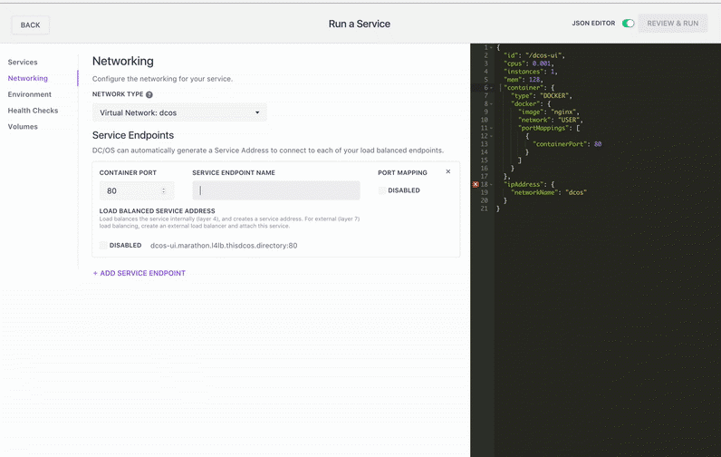

The release notes provide a list of useful topics and links for DC/OS.

# What's New

## Apache Mesos 1.2

- GPU Support
- TaskGroups and Nested Containers (Pods)
- Container exec/attach for debugging
- v1 Master/Agent Operator API
- HTTP(S) and TCP Health Checks
- Support for agent-partition-aware frameworks <!-- [maturity-badge status='experimental'] -->
- Shared persistent volumes across task instances on the same node
- Improved isolation

    - Linux capabilities and rlimit support for UCR
    - Cgroups unified isolator
    - Docker volume isolation
    - New `xfs/disk` isolator to isolate disk resources more efficiently
    - New IPC Namespace isolator to place tasks in a distinct IPC namespace
    - New `volume/sandbox_path` isolator for `Volume::Source::SANDBOX_PATH`.
    - Support Container Network Interface (CNI), and experimental port-mapper CNI plugin: users can now expose container ports through host ports using DNAT. <!-- [maturity-badge status='experimental'] -->

## Container Orchestration

- Marathon 1.4 [release notes](https://github.com/mesosphere/marathon/releases)
- Multiple containers per instance, scheduled on the same host (pods) <!-- [maturity-badge status='experimental'] -->
- Debug why your applications aren’t starting from the GUI and CLI
- Marathon scale improvements

## CLI

- Service account login support (useful for unattended scripts/automation)
- New command for discovering why applications aren’t starting: `dcos marathon debug list`
- Subcommands for package management and service management. <!-- [maturity-badge status='experimental'] -->
- Logging commands `dcos task log` and `dcos node log` use the new [logging API](/docs/1.9/administration/logging/logging-api/) backend. This is a big improvement over using the Files API because you can now stream systemd unit logs for DC/OS system services and logs from tasks that are deployed by Mesos.
- New debugging command: `dcos task exec`. For more information, See the debugging [documentation](/docs/1.9/administration/debugging/).

## Logging <!-- [maturity-badge status='experimental'] -->

- All logs now ship to journald for both Mesos tasks (STDOUT/ERR) and DC/OS system logs.
- Logs from Mesos tasks are tagged with appropriate metadata to allow easy searching by container ID.
- New logging API that sits on top of journald to allow queries to these logs from the DC/OS CLI dcos node log and dcos task log commands.
- Because all logs are going to journald, you can easily setup log aggregation solutions such as logstash to get logs into their aggregated storage solutions.
- The new DC/OS CLI changes allow users to query Mesos task logs as well as DC/OS system service logs from one consolidated tool.

For more information, see the [documentation](/docs/1.9/administration/logging/).

## Metrics <!-- [maturity-badge status='experimental'] -->

- Node-level HTTP API which returns metrics from frameworks, cgroup allocations per container and host level metrics such as load and memory allocation.
- StatsD endpoint in every container for forwarding metrics to the DC/OS metrics service. This service is what exposes the HTTP API.
- Any metric sent to STATSD_UDP_HOST/PORT is available in the HTTP API’s `/container/<container_id>/app` endpoint.

For more information, see the [documentation](/docs/1.9/administration/metrics/).

## Improved GUI

- Brand new look and feel, better navigation.

  

- Significant improvements to how services are created.

  

- Debug why your application isn’t starting from the GUI.

  

## Networking Services

- CNI Support
- Performance improvements

## Package Manager <!-- [maturity-badge status='experimental'] -->

- Support for single binary packages.
- Support for uploading package metadata directly to DC/OS.
- Support for starting services from uploaded packages.

## Debugging

- Remotely execute a process inside a deployed Mesos container with the new CLI `dcos task exec` command.
- CLI feature can accept `--tty` and `--interactive` which allow attaching a PTY to the remotely executed process and streaming of STDIN back from the executed process respectively.

For more information, see the [documentation](/docs/1.9/administration/debugging/).

## Developer Agility

- GitLab Runner (CI) is now available as a DC/OS Service in the Universe.
- Updates to Shakedown, the DC/OS testing harness:

    - Pods support
    - Support for testing against clusters with OAuth
    - Better help output
    - Updated documentation
    - Utility methods for using Mesos-DNS, waiting on cluster actions and partitioning and reconnecting to DC/OS masters

## Upgrades

Improved upgrade tooling and experience for on-premise installations. Upgrades now use internal DC/OS API’s to ensure nodes can be upgraded with minimal disruption to running DC/OS services on a node. The upgrade procedure has also been simplified to improve user experience.

## DC/OS Data Services

- ElasticSearch DC/OS Service <!-- [maturity-badge status='experimental'] -->
- Marathon-style placement constraints for Apache Cassandra Service
- Apache Cassandra schema backup and restore
- Python and R support in the Apache Spark service for DC/OS
- Support for cooperative scheduling in the Apache Cassandra and Apache Kafka services for DC/OS

## DC/OS Internals

- Update DC/OS internal JDK to 8u112 for security [fixes](http://www.oracle.com/technetwork/java/javase/2col/8u112-bugfixes-3124974.html).
- Update DC/OS internal Python from 3.4 to 3.5.
- `dcos_generate_config.sh --aws-cloudformation` will now figure out the region of the s3 bucket automatically, saving some accidental mistakes of getting the region wrong.
- Added `dcos_add_user.py` which adds and invites users to a DC/OS cluster from the command line.
- Added `dcos-shell` which activates the DC/OS environment for running other DC/OS command line tools.
